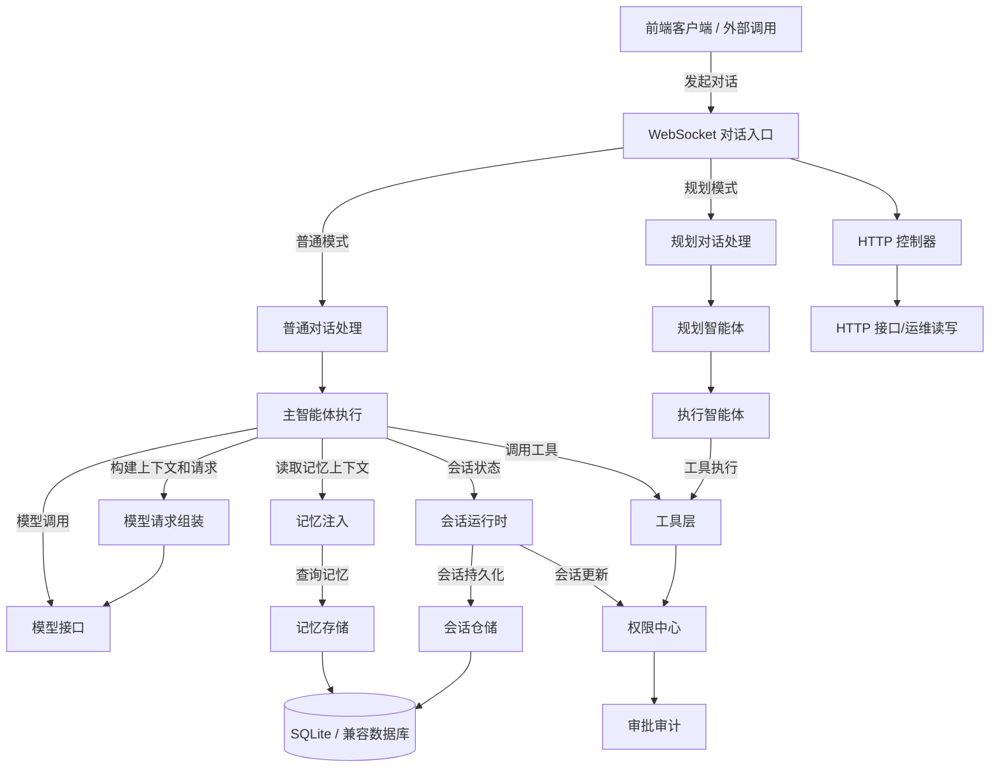

# 后端代码文件级说明

> 更新日期：2026-06-18
> 类型：技术规范
> 关联：[backend/AGENTS.md](../backend/AGENTS.md)

## 可视化总览

## 前端

未开始，仅保留占位（当前本次仅补齐后端文件级说明）。

## 后端

### 模块地图

| 模块 | 文件数 | 主要职责 | 常看入口 |
|---|---:|---|---|
| 对话入口 | 4 | 接收 WebSocket 消息，分发普通 / 规划模式，向前端推流 | [聊天入口](../../backend/src/ws/chat-ws.ts)、[事件推送](../../backend/src/ws/event-sender.ts) |
| 智能体执行 | 35 | 驱动主智能体、规划智能体、执行智能体、工具调用和模型请求 | [主对话执行](../../backend/src/agent/agent-runner.ts)、[规划执行](../../backend/src/agent/manager-runner.ts)、[模型适配](../../backend/src/agent/vllm-model.ts) |
| 运行时 | 48 | 管理会话生命周期、权限审批、上下文压缩和确认流 | [会话运行时](../../backend/src/runtime/session-runtime-service.ts)、[权限中心](../../backend/src/runtime/permissions/manager.ts)、[上下文压缩](../../backend/src/runtime/context/in-loop-compactor.ts) |
| 记忆系统 | 19 | 记忆提取、去重、写入、召回、压缩与提示词注入 | [记忆协调](../../backend/src/memory/coordinator.ts)、[记忆注入](../../backend/src/memory/prompt-injector.ts)、[SQLite 存储](../../backend/src/memory/sqlite-store.ts) |
| 提示词 / 技能 / 任务 | 25 | 组装系统提示词、加载技能、维护任务状态与运行时资源 | [提示词组装](../../backend/src/core/prompts/system-prompts.ts)、[技能加载](../../backend/src/core/skills/skill-loader.ts)、[任务管理](../../backend/src/core/todo/todo-manager.ts) |
| 数据持久化 | 11 | 数据库连接、迁移、会话仓储、记忆仓储、知识库仓储 | [数据库客户端](../../backend/src/db/client.ts)、[迁移入口](../../backend/src/db/migrate.ts)、[会话仓储](../../backend/src/db/runtime-session-repository.ts) |
| HTTP 接口 | 7 | 健康检查、模型、记忆、会话、上下文接口与中间件 | [会话接口](../../backend/src/controllers/sessions.ts)、[模型接口](../../backend/src/controllers/models.ts)、[错误处理](../../backend/src/middlewares/error-handler.ts) |
| 知识检索 | 5 | 文本切片、检索结果封装和知识库查询链路 | [检索入口](../../backend/src/rag/index.ts)、[文本切片](../../backend/src/rag/chunking.ts) |
| 配置 / 类型 / 工具 | 6 | 环境变量、公共类型、日志、扩展能力和本地联调脚本 | [环境配置](../../backend/src/config/env.ts)、[类型入口](../../backend/src/types/index.ts)、[日志](../../backend/src/utils/logger.ts) |

### 阅读入口

| 想看什么 | 先打开哪里 | 再看哪里 |
|---|---|---|
| 一条聊天请求怎么跑完 | [聊天入口](../../backend/src/ws/chat-ws.ts) | [普通模式](../../backend/src/ws/simple-handler.ts)、[主对话执行](../../backend/src/agent/agent-runner.ts) |
| 规划模式如何拆任务 | [规划模式入口](../../backend/src/ws/plan-handler.ts) | [规划智能体](../../backend/src/agent/manager-runner.ts)、[执行智能体](../../backend/src/agent/worker-runner.ts) |
| 工具为什么被允许或拦截 | [工具权限入口](../../backend/src/agent/tool-permission.ts) | [权限检查](../../backend/src/runtime/permissions/checker.ts)、[文件权限](../../backend/src/runtime/permissions/file-operations.ts) |
| 记忆如何进入提示词 | [记忆注入](../../backend/src/memory/prompt-injector.ts) | [增强上下文](../../backend/src/runtime/context/augmented-context-builder.ts)、[提示词序列化](../../backend/src/core/prompts/prompt-serializer.ts) |
| 会话如何持久化和恢复 | [会话服务](../../backend/src/session-v2/session-service.ts) | [会话仓储](../../backend/src/session-v2/session-store.ts)、[运行时服务](../../backend/src/runtime/session-runtime-service.ts) |
| 模型请求长什么样 | [模型请求载荷](../../backend/src/agent/provider-payload.ts) | [vLLM/OpenAI 适配](../../backend/src/agent/vllm-model.ts)、[请求日志](../../backend/src/agent/ai-request-logger.ts) |

### 完整文件索引

展开完整文件清单：164 个后端代码文件的路径、职责和调用链（主要给 Codex / Claude Code 精确定位）

### agent

src/agent/index.ts | 聚合 Agent 入口与导出 | app.ts -> chat-ws -> handlers -> agent
src/agent/agent-runner.ts | 执行单轮/多轮对话流程与工具调用编排 | ws/simple-handler -> agent-runner -> runtime/session-runtime-service
src/agent/manager-runner.ts | 运行 plan 模式规划分支，产出任务树 | ws/plan-handler -> manager-runner -> worker-runner
src/agent/worker-runner.ts | 执行 plan 的子任务与工具调用回报 | manager-runner -> worker-runner -> runtime-permissions
src/agent/vllm-model.ts | 封装 vLLM/OpenAI-compatible 模型请求与响应转换 | agent-runner -> 模型请求层
src/agent/model-registry.ts | 管理模型配置和默认模型分发 | vllm-model -> config/env
src/agent/message-utils.ts | 规范化会话 message 的构建与裁剪工具 | agent-runner -> prompt serializer
src/agent/permission-manager-registry.ts | 管理不同 runner 的工具权限分组 | runtime/permissions/manager -> tool-permission
src/agent/ai-request-logger.ts | 记录模型请求日志与调试字段 | agent-runner -> 日志系统
src/agent/tool-permission.ts | 统一解析 tool 开关与授权策略 | runtime/permissions -> 工具调度
src/agent/provider-stream-debug.ts | 解析模型流式返回的 provider 诊断 | vllm-model -> stream 调试
src/agent/provider-payload.ts | 构建 prompt/user/system/payload 打包 | agent-runner -> 统一模型请求
src/agent/vllm-model.test.ts | 验证模型载荷与请求参数兼容性 | vllm-model 单元测试
src/agent/types.ts | 定义 agent 内部类型契约 | agent-runner/test 双向引用
src/agent/provider-payload.test.ts | 覆盖 payload 构建边界与回归 | agent/provider-payload 单元测试
src/agent/__tests__/tool-permission.test.ts | 工具权限集成回归 | permissions -> tool-registry
src/agent/__tests__/tool-permission-integration.test.ts | 覆盖权限与实际 tool 执行链路 | tool-permission -> runtime-permissions
src/agent/__tests__/in-loop-compaction.integration.test.ts | 覆盖压缩/重试主流程联动 | compact/in-loop -> agent-loop
src/agent/tools/index.ts | 注册与导出标准工具定义 | tool runtime -> simple-handler
src/agent/tools/bash.ts | 运行受控 bash 工具并接入沙箱 | simple-handler -> runtime/permissions
src/agent/tools/read-file.ts | 读取会话文件内容并返回片段 | tool 调度 -> tools/index
src/agent/tools/edit-file.ts | 可控编辑文件并产生日志 | tool 调度 -> write-file
src/agent/tools/write-file.ts | 写文件（带路径安全与确认钩子） | tool 调度 -> runtime/file-operations
src/agent/tools/skill.ts | 调用 skill 并装载运行时上下文 | tool 调度 -> skills registry
src/agent/tools/todo-write.ts | 写入 todo 任务并回写事件 | tool 调度 -> todo-manager
src/agent/tools/request-user-input.ts | 发起交互确认或等待用户输入 | tool 调度 -> ws/event-sender
src/agent/tools/session-tools/index.ts | 汇总会话工具入口 | session-tools 工具 -> ws handlers
src/agent/tools/session-tools/runtime.ts | 会话工具运行时上下文封装 | session-tools -> session-v2
src/agent/tools/session-tools/output.ts | 组织会话工具输出与格式化 | session-tools -> ws/event-sender
src/agent/tools/session-tools/sessions-list.ts | 列出历史会话 | session-tools -> session-service
src/agent/tools/session-tools/sessions-send.ts | 下发消息到既有会话 | session-tools -> session-service
src/agent/tools/session-tools/sessions-spawn.ts | 新建会话与初始化上下文 | session-tools -> session-service
src/agent/tools/session-tools/sessions-history.ts | 查询会话历史用于上下文注入 | session-tools -> session-store
src/agent/tools/session-tools/__tests__/session-tools-output.test.ts | 覆盖会话工具输出格式 | session-tools 单测
src/agent/tools/__tests__/bash.smoke.test.ts | bash 工具端到端烟雾测试 | tools/bash -> 沙箱适配

### config

src/config/env.ts | 加载后端环境变量并标准化配置 | server/app -> 全局服务初始化
src/config/index.ts | 导出配置聚合入口 | app.ts -> 子系统初始化

### controllers

src/controllers/context.ts | 提供上下文快照与运行态查询接口 | 前端 -> API 路由
src/controllers/health.ts | 健康检查与运行态打点 | 运维脚本 -> Express
src/controllers/memory.ts | memory 管理与诊断查询接口 | 会话侧 -> memory/store
src/controllers/models.ts | 查询/验证可用模型与模型参数 | 前端 -> model registry
src/controllers/sessions.ts | 会话创建、更新、删除与列表 API | 前端 -> session-v2/session-service

### core

src/core/agent/agent-config.ts | 定义 Agent 运行时默认配置 | core -> agent 运行器
src/core/memory/config.ts | memory 模块默认参数与阈值定义 | memory/prompt-injector -> memory 存储
src/core/memory/index.ts | memory 子模块导出入口 | runtime/prompt-injector -> coordinator
src/core/prompts/capability-block.ts | 生成 capability block 与 tool 能力片段 | memory prompt -> prompt serializer
src/core/prompts/context-files.ts | 管理 prompt 运行时上下文文件路径 | prompt serializer -> prompt loader
src/core/prompts/prompt-layer-types.ts | 定义 prompt layer 的类型契约 | prompt builder -> serializer
src/core/prompts/prompt-module-files.ts | 读取/校验 prompt module 文件清单 | prompt builder -> context resolver
src/core/prompts/prompt-serializer.ts | 将 layer 与模板序列化成系统提示 | prompt builder -> runtime model request
src/core/prompts/system-prompt-snapshot.ts | 生成会话级 FrozenSystemSnapshot 并记录 source hash | layered prompt -> runtime session
src/core/prompts/system-prompts.ts | 维护 system prompt 规则与默认内容 | prompt builder -> agent requests
src/core/prompts/user-md-parser.ts | 解析 USER.md 与动态块 | prompt builder -> prompt template
src/core/prompts/__tests__/capability-block.test.ts | 验证 capability 片段构造 | prompt 模块 -> unit 回归
src/core/prompts/__tests__/prompt-serializer.test.ts | 验证 prompt 序列化和边界 | serializer -> builder
src/core/prompts/__tests__/system-prompt-snapshot.test.ts | 验证 FrozenSystemSnapshot 构建与恢复 | snapshot builder 单测
src/core/prompts/__tests__/user-md-parser.test.ts | 验证用户配置解析正确性 | parser 单测
src/core/prompts/system-prompts.test.ts | 覆盖 system prompt 组合逻辑 | prompt builder 回归
src/core/skills/skill-loader.ts | 动态加载 skill 与生命周期 | tool 调度 -> skill 执行
src/core/skills/skill-loader.test.ts | 覆盖 skill 加载容错 | skill-loader 单测
src/core/skills/skill-session.ts | 管理 skill 作用域与 session 上下文 | skill-loader -> runtime session
src/core/skills/skill-session.test.ts | 验证 skill-session 边界 | skill-session 单测
src/core/runtime-bundle.ts | 打包 runtime 运行时资源清单 | runtime/startup -> runtime bundle consumer
src/core/runtime-paths.ts | 统一管理 runtime 目录与文件路径 | runtime/storage -> 文件系统
src/core/runtime-storage-migration.ts | 处理 runtime 数据结构迁移 | app startup -> runtime storage
src/core/runtime-storage-migration.test.ts | 覆盖 runtime 数据迁移逻辑 | migration 单测
src/core/todo/todo-manager.ts | 任务状态写入与变更回写 | todo 工具 -> ws/event 更新

### db

src/db/client.ts | 提供数据库客户端与连接生命周期 | memory/store + session-store -> sqlite/dmmdb
src/db/knowledge-repository.ts | 知识库数据读写与查询封装 | rag/索引 -> 记忆检索
src/db/knowledge-repository.test.ts | 覆盖知识库 DAO 行为 | repository 单测
src/db/memory-repository.ts | memory 事实写入与读取仓储层 | memory/store -> memory-search
src/db/memory-search-repository.ts | memory 检索索引访问层 | memory/compact -> memory prompt-injector
src/db/migrate.ts | 运行数据库迁移入口 | app startup -> migration scripts
src/db/runtime-session-repository.ts | session 状态持久化与加载 | session-v2/session-store

### middlewares

src/middlewares/error-handler.ts | 捕获未处理异常并统一返回错误响应 | Express -> controller
src/middlewares/request-logger.ts | 记录请求链路与 tracing 字段 | app.ts -> 控制器与 WS 协议

### dev

src/dev/live-event-extraction-smoke.ts | 本地联调脚本，验证 live event 提取 | 开发调试 -> ws/event-sender
src/dev/pg-acceptance-smoke.ts | PG 运行时联调入口 | 开发调试 -> db/repositories
src/dev/ws-pg-acceptance.ts | WS + PG 联调脚本 | 开发调试 -> chat-ws

### extensions

src/extensions/archive-api.ts | 封装归档相关外部接口 | runtime -> 插件扩展层
src/extensions/dmdb-pool.ts | 数据库连接池兼容层 | db/client -> pg 连接
src/extensions/execute-sql.ts | 执行 SQL 片段并返回结果 | tool/maintenance -> db/migrations
src/extensions/index.ts | 扩展能力导出入口 | app.ts -> extension registry

### memory

src/memory/coordinator.ts | 调度 memory 采集、清洗与写回流程 | memory/store -> memory/sqlite-store
src/memory/extraction-runner.ts | 运行一次记忆抽取任务并落库 | prompts/event -> memory/flush
src/memory/flush.ts | 提交轮次 memory 变更到持久层 | memory/coordinator -> memory/sqlite-store
src/memory/compact.ts | 执行记忆 compact 与摘要更新 | memory/search -> memory/flush
src/memory/compact.test.ts | 验证 compact 行为与阈值 | compact 单测
src/memory/coordinator.test.ts | 覆盖协调流程与异常分支 | coordinator 单测
src/memory/dedupe.sql | sqlite 去重与索引辅助 SQL | memory/sqlite-store -> db 初始化
src/memory/foresight-sync.ts | 记忆前瞻同步和写回策略 | memory/prompt-injector -> memory/store
src/memory/foresight-sync.test.ts | 覆盖前瞻同步流程 | foresight-sync 单测
src/memory/index.ts | memory 子模块导出中心 | memory APIs -> coordinator
src/memory/prompt-injector.ts | 将检索记忆注入 prompt chain | runtime/context -> agent-runner
src/memory/prompt-injector.test.ts | 覆盖记忆注入链路 | prompt-injector 单测
src/memory/project-id.ts | 项目维度记忆过滤工具函数 | memory/store -> coordinator
src/memory/sqlite-store.ts | SQLite 存储接口与查询 | coordinator -> db/client
src/memory/store.ts | 核心 memory store facade | memory APIs -> sqlite-store
src/memory/types.ts | memory 数据模型与常量 | memory 模块内共享
src/memory/__tests__/prompt-injector.test.ts | 覆盖记忆 prompt 注入边界 | prompt-injector unit
src/memory/__tests__/sqlite-store.test.ts | 验证 SQLite 存储行为 | sqlite-store 单测
src/memory/__tests__/store.test.ts | 验证 store facade 行为 | store 单测

### migrations

src/db/migrations/0001_init_runtime_tables.sql | 初始化运行时主表结构 | db/migrate -> runtime/session
src/db/migrations/0002_init_memory_tables.sql | 创建 memory 相关表与索引 | db/migrate -> memory/coordinator
src/db/migrations/0003_memory_search_indexes.sql | 补齐 memory 检索索引 | db/migrate -> memory-search
src/db/migrations/0004_init_knowledge_tables.sql | 初始化 knowledge 仓储表 | db/migrate -> knowledge-repository

### runtime

src/app.ts | 创建 Express 应用与中间件链路 | server.ts -> app
src/server.ts | 启动 HTTP/WS 服务入口 | 根脚本 -> app.ts
src/runtime/approval-audit.ts | 记录确认与审批事件审计 | permissions/broker -> db
src/runtime/confirmation-broker.ts | 管理异步确认流程与超时 | tools/request-user-input -> ws/event-sender
src/runtime/index.ts | 运行时服务导出入口 | runtime consumers -> runtime modules
src/runtime/pi-session-core/session-manager.ts | 会话运行时状态核心管理 | session-v2/session-service -> runtime层
src/runtime/pi-session-core/session-manager.test.ts | 验证 session-manager 流程 | session-manager 单测
src/runtime/projections.ts | 根据事件构建会话投影视图 | ws/event-sender -> session-v2
src/runtime/session-key.ts | 计算会话 key 与路由映射 | runtime/session-service -> ws
src/runtime/session-runtime-service.ts | 运行时 session 生命周期管理 | ws handler -> session-v2/session-service
src/runtime/context/augmented-context-builder.ts | 组装增强上下文传给 agent | agent-runner -> prompt injector
src/runtime/context/augmented-context-builder.test.ts | 覆盖上下文增强链路 | augmented-context-builder 单测
src/runtime/context/in-loop-compactor.ts | 流式过程中的上下文压缩触发 | runtime/context -> compact pipeline
src/runtime/context/in-loop-compactor.test.ts | 验证在线压缩行为 | in-loop-compactor 单测
src/runtime/context/templates/compact-summary.template.ts | 提供 compact summary 模板 | compact -> prompt layer
src/runtime/context/templates/memory-recall.template.ts | 提供记忆召回注入模板 | memory/prompt-injector -> runtime/context
src/runtime/permissions/manager.ts | 管理运行时权限策略实例 | runtime/permissions/index -> tool-permission
src/runtime/permissions/audit-log.ts | 记录权限判定与拒绝记录 | runtime/permissions -> 中控审计
src/runtime/permissions/bash-classifier.ts | 区分高风险 bash 命令并标记 | tool bash -> permissions/ checker
src/runtime/permissions/checker.ts | 统一权限校验入口 | tool -> sandbox / broker
src/runtime/permissions/dangerous-paths.ts | 维护危险路径清单与匹配器 | checker -> request validator
src/runtime/permissions/file-operations.ts | 约束文件操作权限边界 | edit-file/read-file/write-file -> runtime
src/runtime/permissions/index.ts | 权限模块统一导出 | runtime layer -> permissions
src/runtime/permissions/loader.ts | 动态加载权限规则文件 | runtime startup -> permissions manager
src/runtime/permissions/path-validation.ts | 路径合法性校验 | file-operations -> checker
src/runtime/permissions/sandbox-adapter.ts | 将权限结果转为沙箱指令 | runtime checker -> sandbox执行器
src/runtime/permissions/tier-bridge.ts | 映射不同风险等级策略 | checker -> permission UI
src/runtime/permissions/types.ts | 运行时权限类型定义 | permissions模块内部引用
src/runtime/permissions/updater.ts | 热更新权限规则与生效 | runtime startup -> 权限中心
src/runtime/permissions/__tests__/audit-log.test.ts | 验证审计日志写入 | audit-log 单测
src/runtime/permissions/__tests__/bash-classifier.test.ts | 验证 bash 风险分类 | bash-classifier 单测
src/runtime/permissions/__tests__/checker.test.ts | 验证权限总线行为 | checker 单测
src/runtime/permissions/__tests__/dangerous-paths.test.ts | 覆盖危险路径规则 | dangerous-paths 单测
src/runtime/permissions/__tests__/file-operations.test.ts | 验证文件权限拦截 | file-operations 单测
src/runtime/permissions/__tests__/loader-updater.test.ts | 验证动态加载与更新 | loader/updater 单测
src/runtime/permissions/__tests__/manager.test.ts | 验证权限管理器生命周期 | manager 单测
src/runtime/permissions/__tests__/path-validation.test.ts | 验证路径校验 | path-validation 单测
src/runtime/permissions/__tests__/tier-bridge.test.ts | 验证风险等级映射 | tier-bridge 单测
src/runtime/__tests__/approval-flow.test.ts | 覆盖审批流程与 tool 确认链路 | approval-broker -> session-runtime-service
src/runtime/__tests__/confirmation-broker.test.ts | 验证确认 broker 的超时与状态机 | confirmation-broker 单测
src/runtime/__tests__/system-prompt-snapshot-runtime.test.ts | 验证 runtime 复用和恢复 system snapshot | session-runtime-service 回归
src/session-v2/index.ts | session-v2 模块聚合导出 | handlers -> session-v2 服务
src/session-v2/session-key.ts | 兼容 session-v2 的 key 生成规则 | session service -> cache/store
src/session-v2/session-policy.ts | 定义会话策略与保留规则 | ws -> session-v2
src/session-v2/session-pruner.ts | 周期裁剪与过期会话 | session-policy -> session-store
src/session-v2/session-service.ts | 会话 CRUD + 生命周期状态机 | controller/handlers -> session store
src/session-v2/session-store.ts | 会话持久化与查询访问层 | session-service -> db/client
src/session-v2/types.ts | 会话 V2 类型定义 | session-v2 全链路

### types

src/types/api.ts | 定义 API/request/response 类型 | controllers/ws -> shared type contracts
src/types/api.test.ts | 覆盖 API 类型转换边界 | api types 单测
src/types/index.ts | 类型导出入口 | 后端模块 -> 全局引用

### rag

src/rag/chunking.ts | 文本切片与嵌入前预处理 | memory/prompt -> search pipeline
src/rag/chunking.test.ts | 验证 chunking 结果与边界 | chunking unit
src/rag/index.ts | RAG 查询入口与结果封装 | memory/search -> runtime context
src/rag/index.test.ts | 覆盖 RAG 查询联动链 | rag/index 单测
src/rag/types.ts | RAG 的请求/结果类型定义 | rag/index -> memory/store

### utils

src/utils/logger.ts | 日志包装与统一日志字段 | runtime 全链路 -> 运行日志

### ws

src/ws/chat-ws.ts | WebSocket 消息入口与路由分发 | 客户端 WS -> simple-handler/plan-handler
src/ws/event-sender.ts | 推送增量消息与事件流 | handler -> websocket 客户端
src/ws/simple-handler.ts | simple 模式 WS handler，接入 agent-runner | chat-ws -> agent-runner
src/ws/plan-handler.ts | plan 模式 WS handler，接入 manager/worker | chat-ws -> manager-runner

